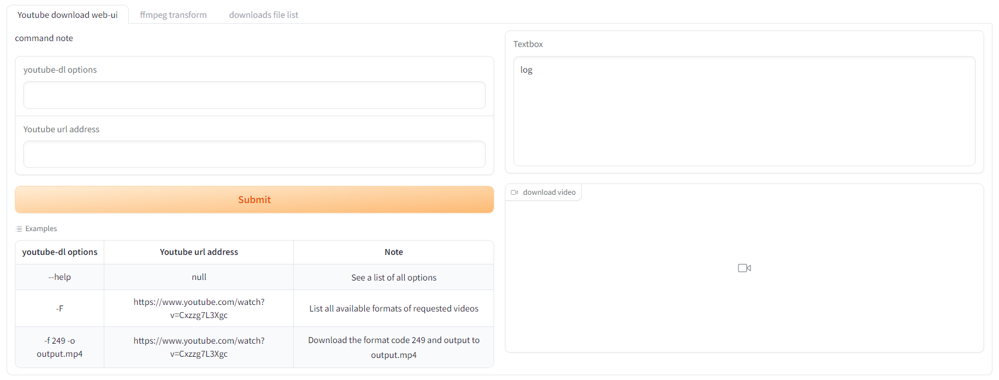
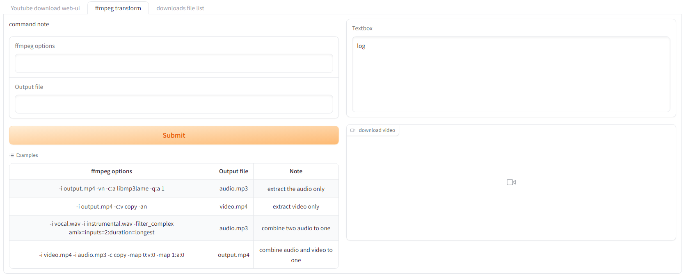
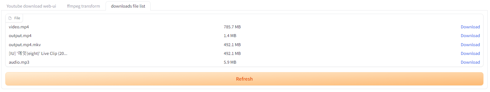

## youtube-dl-webui - add the gradio ui for the youtube-dl and ffmpeg command

Recently I try to play the generative AI. It takes some time to download video, separate audio and download it from server. 
I found the gradio interface is easy to run those commands and return the output video or audio for evaluate. 
Enjoy it.

- [INSTALLATION](#installation)
- [HOW TO USE](#how-to-use)

# INSTALLATION

## run on docker-compose
```bash
docker-compose build
docker-compose up -d
```

Open your browser to 
http://localhost:7860/

## run on python
```bash
sudo apk install ffmpeg
pip install gradio
python web-ui.py
```

Open your browser to 
http://localhost:7860/

# HOW TO USE

## youtube-dl 
Input the options and Youtube url address, then click Submit button.
After downloading is finish, you can see the video or audio on the video component. 

You can select the Example to test it.




## ffmpeg
After downloading the video file, you may need to separate video or audio. 
Or you may need to merge two audios together. ffmpeg is very useful tool to do that. 

You can select the Example to test it.



## files list
The youtube-dl or ffmpeg output file will put under the downloads directory. 
You can list the files under it in the tab.



